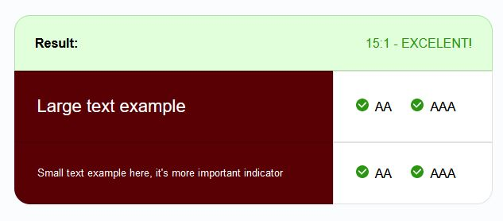
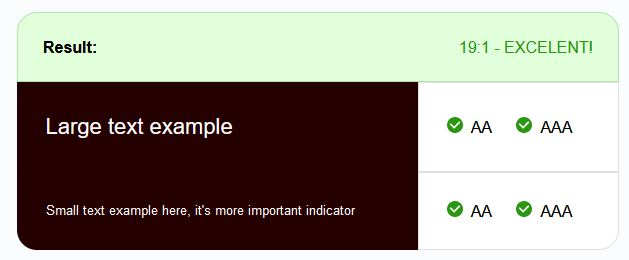
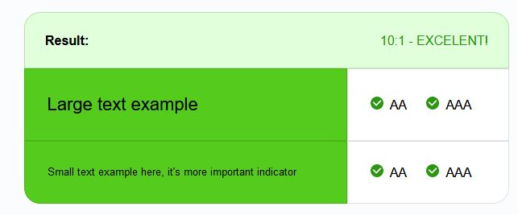
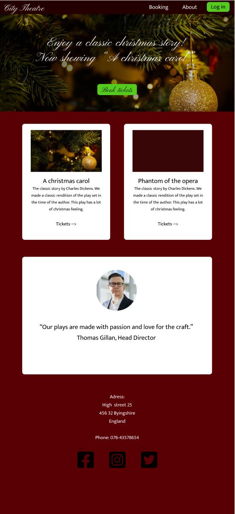
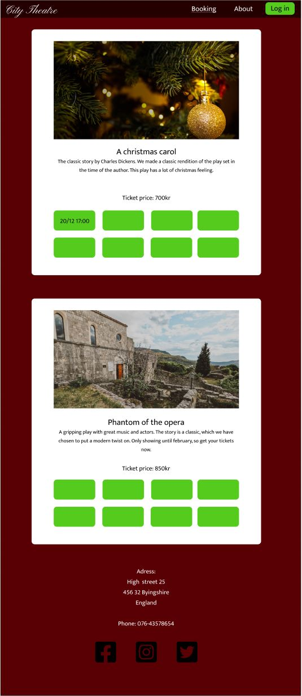
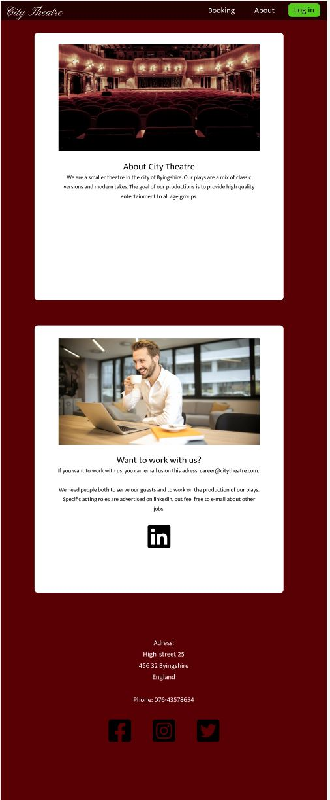

# Theatre booking website
A website for a made up theatre, with booking functions. This website was made as the fourth project of the Code Institute's diploma in software development.

## UX - User Experience
### User Stories
I want the costumer to be able to:
- See what dates the plays are.
- Make bookings, reebook and cancel bookings.
- See their booking information.

I want the admin to be able to:
- See the bookings made.
- Change and cancel bookings.

### Colour
I chose to use red bacause it is a common colour used in theatres. I have a lighter and a darker red for background and menues. Then i have a green for buttons, and black and white for the text. White is also used for the content fields.

All colours passed the [Accessibility Checker's](https://www.accessibilitychecker.org/color-contrast-checker/) colour contrast test.

### Structure and typography
I wanted the website to look classy and to remind people of a theatre (tried to do that with the background colour).
#### Structure
These are the innitial wireframes.

#### Typography
All fonts are san serif due to it being easier to read on a screen. The fonts i chose were Mukta for the content, and Pinyon Script for "city theatre" at the top. It is also used for some of the text ont he log in page and the promotional image.

## Features
### Starting page

### Potential features

## Testing

### User stories

### Device testing

### Browser testing

### Peer review

### Validator testing

### Software testing

#### JavaScript testing - Jest

#### Python testing

### Bugs
#### Fixed bugs

#### Unfixed bugs

### Deployment
This project was deployed with Heroku.

- Create an account at Heroku, and do not forget you need to confirm your e-mail to do this.
- Create a list of dependencies in a text file named requirements (pip3 freeze > requirements.txt).
- Create an app by clicking the "create a new app" button found on the dashboard.
    - Choose a unique app name.
    - Choose your region and click "create app"
- Click on settings (for the app).
    - Find the Config Vars section and add potential files that you cannot upload to github. For example API credentials. KEY is the title, and VALUE is the content. For thos project you need to add the Django key and the database-url.
    - Add buildpacks (below Config Vars). For this project, I installed Python and Node.js. Make sure they are in the correct order.
- Go to the deploy section.
    - Choose to deploy from GitHub.
    - Connect your account and choose a repository to deploy from.
    - Choose either Automatic or Manual deployment (recommended).
- Make sure the live site is working.
 

## Credits

### Code
The Backend part of the code is based on Code Institute's "I think therefore i blog" walkthru project. The front end part is madde usiong a modified version of the [Clean blog](https://startbootstrap.com/theme/clean-blog) template from [startbootstrap](startbootstrap.com).

### Content and media
The pictures for this project is from [pexels.com](www.pexels.com). The [christmas picture](https://www.pexels.com/photo/gold-christmas-bauble-246351/) is from the user Valeria Vinnik, the [house picture](https://www.pexels.com/photo/stone-building-on-a-countryside-5667618/) is from the user ROMAN ODINTSOV, the [theatre picture](https://www.pexels.com/photo/theater-interior-109669/) is from the user Donald Tong, the [jobs picture](https://www.pexels.com/photo/depth-of-field-photo-of-man-sitting-on-chair-while-holding-cup-in-front-of-table-927451/) is from the user Andrea Piacquadio, and the [head director picture](https://www.pexels.com/photo/man-wearing-white-dress-shirt-and-black-blazer-2182970/) is from the user LinkedIn Sales Navigator.

All icons are from [font awesome](https://fontawesome.com/icons), and the fonts are from [Google fonts](https://fonts.google.com/).
